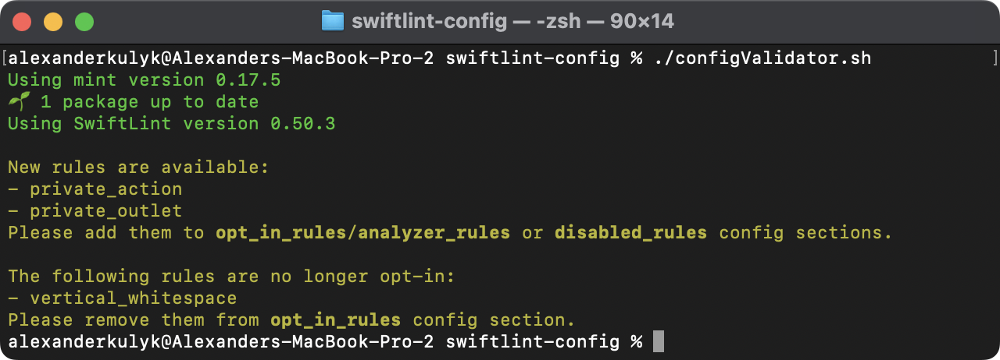
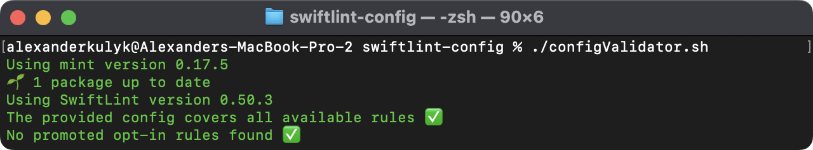
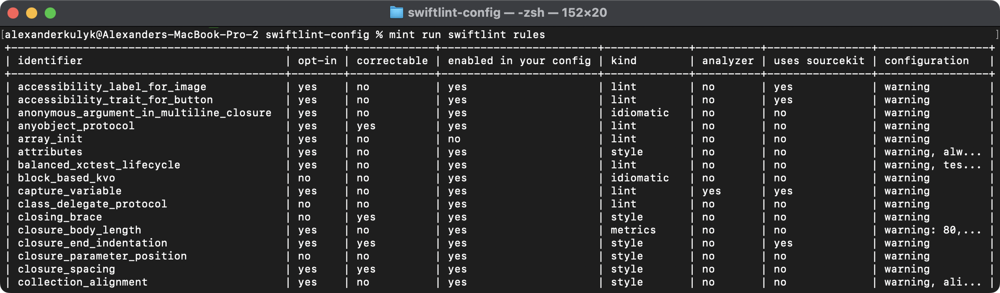
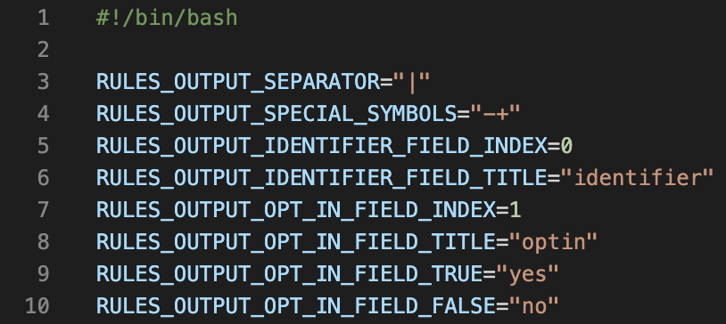
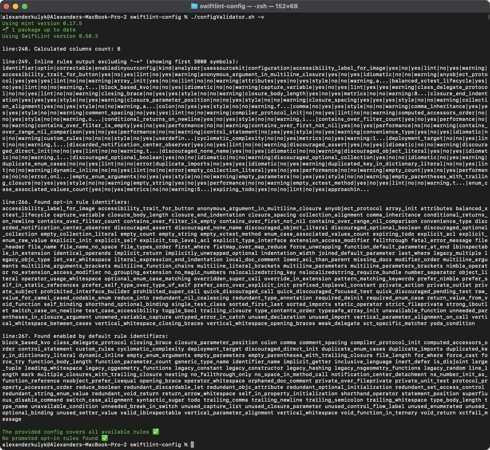
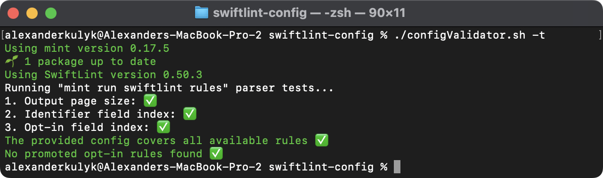
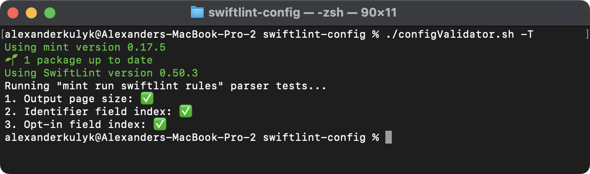
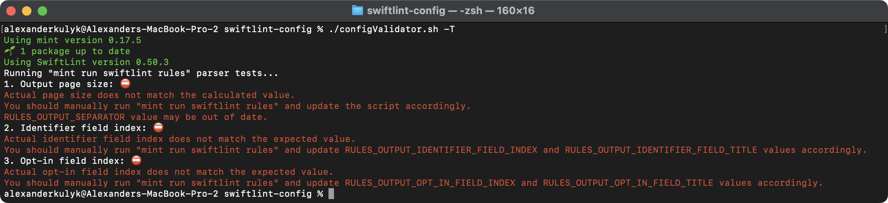

# Config Validator Documentation

- [1. Dependencies](#1-dependencies)
- [2. How to use](#2-how-to-use)
- [3. Resolving possible issues](#3-resolving-possible-issues)
- [4. Built-in tests](#4-built-in-tests)

This config validator script finds and outputs:
- ***opt-in rules*** that are provided by the selected SwiftLint version but are not mentioned in the [.swiftlint.yml](./.swiftlint.yml) config file;
- ***rules enabled by default*** that are listed in the `opt_in_rules` config file section.

It is achieved by comparing the `swiftlint rules` output with the config file contents. Here is an example:
<p align="center">
    
</p>

### 1. Dependencies 

The script uses [mint](https://github.com/yonaskolb/Mint) for SwiftLint version control and requires it to run.

### 2. How to use

- Specify new SwiftLint version number in the [Mintfile](./Mintfile).

- Run the script file as an executable:
    ```
    ./configValidator.sh
    ```

- After adding all of new rules to the config file, you should see the success message:
    <p align="center">
        
    </p>
    If you observe any unexpected behavior, see the next chapter.

### 3. Resolving possible issues

This script relies on `mint run swiftlint rules` output consistency and, therefore, may require manual updates:
<p align="center">
    
</p>

The main parsing logic assumptions are stored as global variables at the beginning of the script:
<p align="center">
    
</p>

If you see any issues with the output, try manually running `mint run swiftlint rules` and update the variables accordingly:
- `RULES_OUTPUT_SEPARATOR` defines the output separator symbol.
- `RULES_OUTPUT_SPECIAL_SYMBOLS` contains output symbols that will be removed before processing.
- `RULES_OUTPUT_IDENTIFIER_FIELD_INDEX` defines the index for the ***rule identifier name*** field in the output table.
- `RULES_OUTPUT_IDENTIFIER_FIELD_TITLE` defines the header for the ***rule identifier name*** field in the output table.
- `RULES_OUTPUT_OPT_IN_FIELD_INDEX` defines the index for the ***opt-in status*** field in the output table.
- `RULES_OUTPUT_OPT_IN_FIELD_TITLE` defines the header for the ***opt-in status*** field in the output table (excluding the `RULES_OUTPUT_SPECIAL_SYMBOLS`).
- `RULES_OUTPUT_OPT_IN_FIELD_TRUE` and `RULES_OUTPUT_OPT_IN_FIELD_FALSE` are responsible for the positive and negative ***opt-in status*** field values.

If you will need an in-depth script debugging, the `-v` option for verbose output may help.
    <details>
    <summary>Verbose output example.</summary>
    
    </details>

### 4. Built-in tests

To ensure parsing validity, the script includes 3 test cases:

1. The ***page size*** test case verifies that the number of columns in the `swiftlint rules` output table was calculated correctly.
2. The ***identifier field index*** test case verifies that the `swiftlint rules` output table contains the identifier names column at the expected index.
3. The ***opt-in field index*** test case verifies that the `swiftlint rules` output table contains the opt-in status column at the expected index.

You can run them along with the main script by adding the `-t` option, or run only tests with the `-T` option:
<p align="center">
    
    
</p>

Failing tests provide suggestions on possible solutions:
<p align="center">
    
</p>